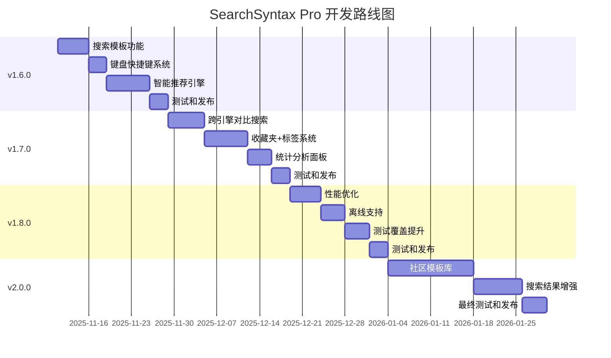

# 实施路线图

> **文档版本**: v1.0
> **规划周期**: 4-6 个月
> **目标版本**: v1.6.0 - v2.0.0

---

## 版本规划总览

---

## Phase 1: v1.6.0 - 核心体验提升

**时间**: 2-3 周
**状态**: 📋 规划中
**重点**: 降低学习成本,提升操作效率

### Week 1: 搜索模板功能

#### Day 1-2: 数据结构和模板定义
- [ ] 设计 SearchTemplate 接口
- [ ] 定义至少 15 个内置模板
- [ ] 实现 TemplateManager 服务

**交付物**:
- `src/types/template.ts`
- `src/data/builtin-templates.ts`
- `src/services/template-manager.ts`

#### Day 3-4: UI 组件开发
- [ ] TemplateSelector 组件
- [ ] 模板卡片设计
- [ ] 分类筛选功能

**交付物**:
- `src/components/TemplateSelector.tsx`
- 单元测试

#### Day 5: 集成和测试
- [ ] 集成到主界面
- [ ] E2E 测试
- [ ] 性能优化

### Week 2: 键盘快捷键系统

#### Day 1-2: 快捷键框架
- [ ] 快捷键定义 (至少 15 个)
- [ ] ShortcutManager 实现
- [ ] 事件监听和分发

**交付物**:
- `src/config/keyboard-shortcuts.ts`
- `src/services/shortcut-manager.ts`

#### Day 3: UI 和帮助文档
- [ ] 快捷键帮助面板
- [ ] 自定义快捷键设置
- [ ] 冲突检测

**交付物**:
- `src/components/ShortcutHint.tsx`
- `src/components/ShortcutSettings.tsx`

### Week 3: 智能推荐引擎

#### Day 1-3: 推荐算法
- [ ] SuggestionEngine 核心逻辑
- [ ] 关键词模式识别 (8+ 规则)
- [ ] 历史分析算法

**交付物**:
- `src/services/suggestion-engine.ts`
- 单元测试 (覆盖率 > 80%)

#### Day 4-5: UI 集成
- [ ] SuggestionPanel 组件
- [ ] 实时推荐展示
- [ ] 一键应用功能

**交付物**:
- `src/components/SuggestionPanel.tsx`

#### Day 6-7: 优化和测试
- [ ] 规则优化
- [ ] 性能测试
- [ ] 用户体验调优

### 版本发布

**发布前检查清单**:
- [ ] 所有功能测试通过
- [ ] 性能指标达标
  - 模板加载 < 200ms
  - 快捷键响应 < 50ms
  - 推荐生成 < 100ms
- [ ] 文档更新
- [ ] 变更日志编写

**预期成果**:
- 新用户留存率: 40% → 60%
- 模板使用率: 0% → 40%
- 快捷键使用率: 0% → 20%

---

## Phase 2: v1.7.0 - 功能扩展

**时间**: 3-4 周
**重点**: 扩展使用场景,知识库管理

### Week 1-2: 跨引擎对比搜索

#### Day 1-3: 核心功能
- [ ] ComparisonSearch 数据结构
- [ ] 多引擎查询构建
- [ ] 标签分组管理

#### Day 4-6: UI 实现
- [ ] 引擎选择器
- [ ] 对比结果展示
- [ ] 模板保存

### Week 2-3: 收藏夹 + 标签系统

#### Day 1-3: 数据层
- [ ] SearchBookmark 接口
- [ ] BookmarkManager 服务
- [ ] IndexedDB 存储

#### Day 4-7: UI 和交互
- [ ] 收藏夹面板
- [ ] 标签管理
- [ ] 搜索和过滤
- [ ] 导入/导出

### Week 3-4: 统计分析面板

#### Day 1-2: 数据收集
- [ ] Analytics 数据结构
- [ ] 数据采集逻辑

#### Day 3-4: 可视化
- [ ] 图表组件 (Chart.js)
- [ ] 仪表盘布局
- [ ] 数据导出

### 版本发布

**预期成果**:
- 日均搜索次数: 5次 → 12次
- 收藏夹使用率: 0% → 30%
- 用户满意度: 7.5 → 8.8

---

## Phase 3: v1.8.0 - 技术优化

**时间**: 2-3 周
**重点**: 性能、稳定性、测试

### Week 1: 性能优化

#### Day 1-2: 虚拟滚动
- [ ] react-window 集成
- [ ] 历史列表优化
- [ ] 收藏夹列表优化

#### Day 3-4: 代码分割和懒加载
- [ ] Vite 配置优化
- [ ] 适配器懒加载
- [ ] 组件懒加载

#### Day 5: IndexedDB 升级
- [ ] HybridStorage 实现
- [ ] 数据迁移脚本

### Week 2: 离线支持

#### Day 1-2: Service Worker
- [ ] 缓存策略设计
- [ ] Service Worker 实现

#### Day 3-4: 测试和优化
- [ ] 离线功能测试
- [ ] 缓存管理

### Week 3: 测试覆盖提升

#### Day 1-2: 单元测试
- [ ] Adapters 测试 (90%)
- [ ] Services 测试 (85%)
- [ ] Utils 测试 (95%)

#### Day 3-4: E2E 测试
- [ ] 核心流程覆盖
- [ ] 边界case测试

### 版本发布

**预期成果**:
- 加载时间: 1.2s → 0.8s
- 内存占用: 50MB → 35MB
- 测试覆盖率: 45% → 80%+
- Bug数量: 20/月 → 10/月

---

## Phase 4: v2.0.0 - 创新突破

**时间**: 4-6 周
**重点**: 社区生态,差异化价值

### Week 1-3: 社区模板库

#### Week 1: 后端基础设施
- [ ] API 设计
- [ ] 数据库 Schema
- [ ] 认证系统

#### Week 2: 核心功能
- [ ] 上传/下载
- [ ] 搜索/过滤
- [ ] 评分/评论

#### Week 3: 高级功能
- [ ] 审核流程
- [ ] 举报系统
- [ ] 统计分析

### Week 4-5: 搜索结果增强

#### Week 4: 基础框架
- [ ] Content Script 注入
- [ ] 引擎检测和适配
- [ ] 工具栏 UI

#### Week 5: 核心功能
- [ ] 导出结果
- [ ] 保存搜索
- [ ] 语法高亮

### Week 6: 最终测试和发布

#### 全面测试
- [ ] 功能测试
- [ ] 性能测试
- [ ] 兼容性测试
- [ ] 安全测试

#### 文档完善
- [ ] 用户手册
- [ ] API 文档
- [ ] 开发者指南
- [ ] 贡献指南

### 版本发布

**预期成果**:
- 用户满意度: 8.8 → 9.5/10
- 社区模板数: 50+
- 用户留存率: 70% → 80%

---

## 关键里程碑

| 里程碑 | 目标日期 | 关键指标 |
|--------|---------|---------|
| v1.6.0 发布 | 2025-11-29 | 新用户留存率 60% |
| v1.7.0 发布 | 2025-12-19 | 日均搜索次数 12次 |
| v1.8.0 发布 | 2026-01-04 | 测试覆盖率 80%+ |
| v2.0.0 发布 | 2026-01-30 | 用户满意度 9.5/10 |
| 社区上线 | 2026-02-15 | 社区模板 50+ |

---

## 资源配置

### 人力需求

| 阶段 | 开发 | 测试 | 设计 |
|------|------|------|------|
| Phase 1 | 1-2人 | 0.5人 | 0.5人 |
| Phase 2 | 1-2人 | 0.5人 | 0.5人 |
| Phase 3 | 1-2人 | 1人 | - |
| Phase 4 | 2-3人 | 1人 | 1人 |

### 技术栈

**新增依赖**:
- Zustand (状态管理)
- react-window (虚拟滚动)
- Chart.js (图表)
- DOMPurify (安全)

**开发工具**:
- ESLint + Prettier
- Jest + Playwright
- Chrome DevTools
- GitHub Actions

---

## 风险管理

### 技术风险

| 风险 | 影响 | 概率 | 缓解措施 |
|------|------|------|---------|
| 性能优化效果不理想 | 高 | 中 | 提前性能测试,备选方案 |
| IndexedDB 兼容性问题 | 中 | 低 | 降级策略,Chrome Storage 备份 |
| 社区模板审核成本高 | 高 | 高 | 自动化审核,社区举报 |

### 进度风险

| 风险 | 影响 | 概率 | 缓解措施 |
|------|------|------|---------|
| 功能复杂度超预期 | 高 | 中 | 分阶段交付,MVP 优先 |
| 测试时间不足 | 高 | 中 | 自动化测试,提前介入 |
| 资源不足 | 中 | 低 | 优先级调整,外部协作 |

---

## 质量保证

### Code Review 标准
- [ ] 代码符合 ESLint 规则
- [ ] 函数复杂度 < 10
- [ ] 测试覆盖率 > 80%
- [ ] 无 TypeScript 错误
- [ ] 性能无明显下降

### 发布前检查
- [ ] 所有测试通过
- [ ] 性能指标达标
- [ ] 安全审计通过
- [ ] 文档完整
- [ ] 变更日志更新

---

## 反馈和迭代

### 用户反馈渠道
- GitHub Issues
- 用户调研问卷
- Chrome Web Store 评论
- 社区论坛

### 数据监控
- 功能使用率统计
- 性能指标监控
- 错误日志收集
- 用户满意度调查

---

**下一步**: 开始 [v1.6.0 开发](./01-priority-p0-core-features.md)
